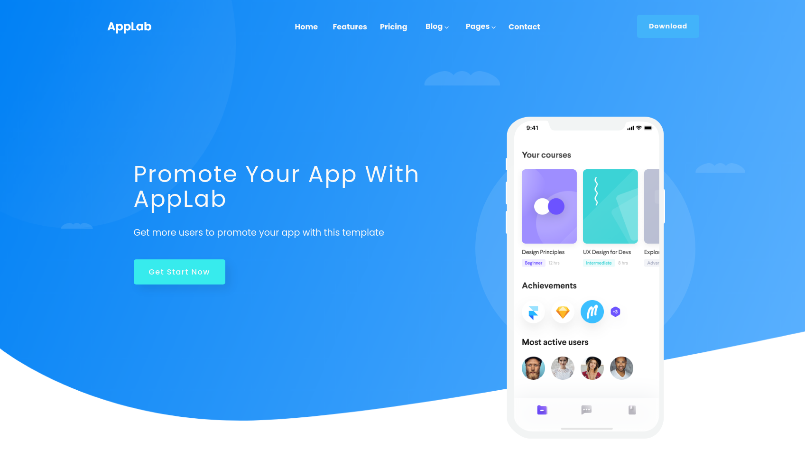
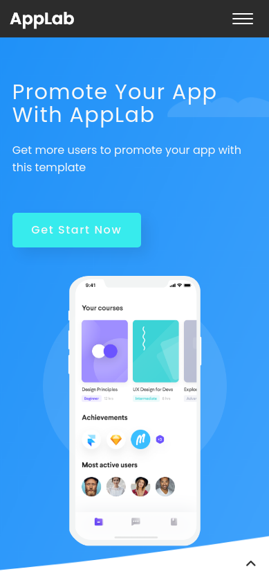
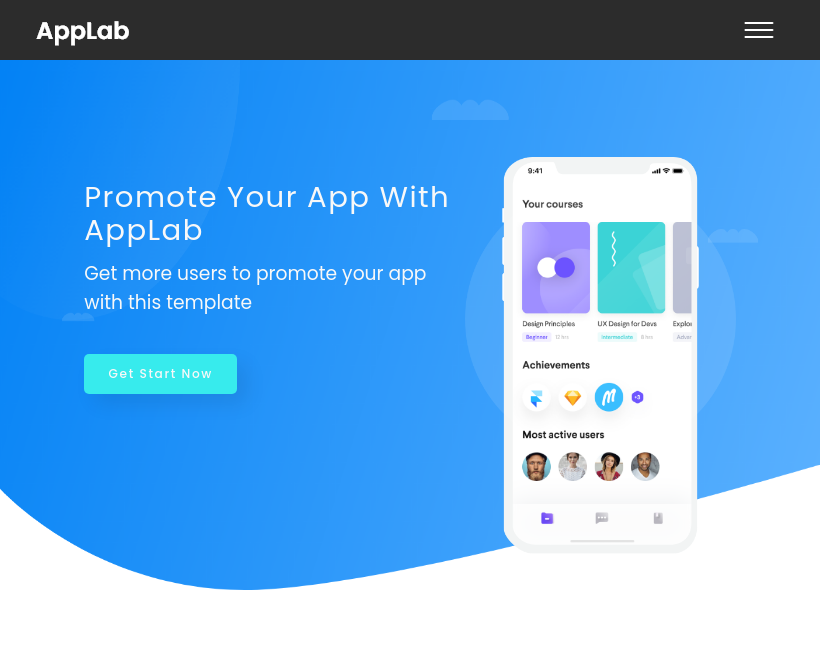
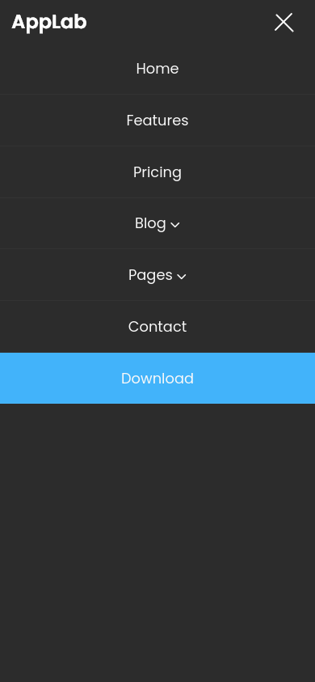

# AppLab RWD template project

See the live version of [AppLab RWD](https://mikepatch.github.io/AppLab-RWD-template-project/).

Pure HTML & CSS responsive project based on free [Colorlib](https://colorlib.com/) template. I created this project to improve my acquired skills.

**Main features**:
- **RWD** – media queries, flexbox, clamp, dvh
- Pure HTML & CSS
- **BEM** methodology
- CSS **variables**
- Semantic HTML
- Pure CSS/HTML animations
- Animated hamburger menu (without JS)

&nbsp;

## :wrench: Tools and technologies

&nbsp;

## :camera: Few screenshots ##

### Smartphone ###

&nbsp;

### Tablet ###

### Mobile menu ###

&nbsp;

## 🤔 Solutions provided in the project

- 100% viewport height header on mobile using new `dvh` CSS unit.

The new `dvh` unit allows us to control the height of our element depending on the height of the viewport, e.g. the scalable search bar in Safari.

 &nbsp;

- Issues and solutions

| Issue                     | Solution                       |     |
| ------------------------- | -----------------------------  | --- |
| overlapping dropdown menu on nav link                       | `z-index: -1;` on dropdown menu           |     |

## 🙋‍♂️ Feel free to contact me
Find me on...

&nbsp;

## 👏 Thanks / Credits
Thanks to my [Mentor - devmentor.pl](https://devmentor.pl/) – for providing me with this task and for code review and [Colorlib](https://colorlib.com/) – for free template.